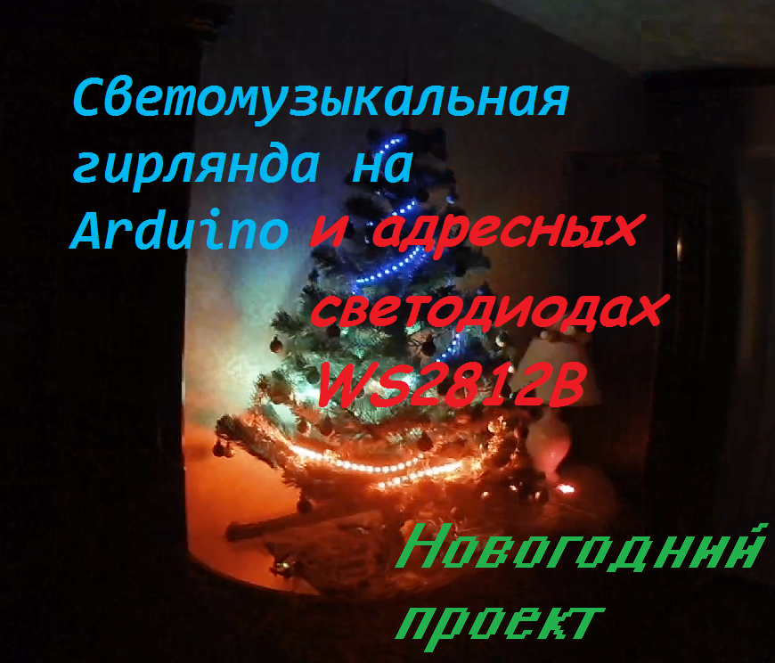
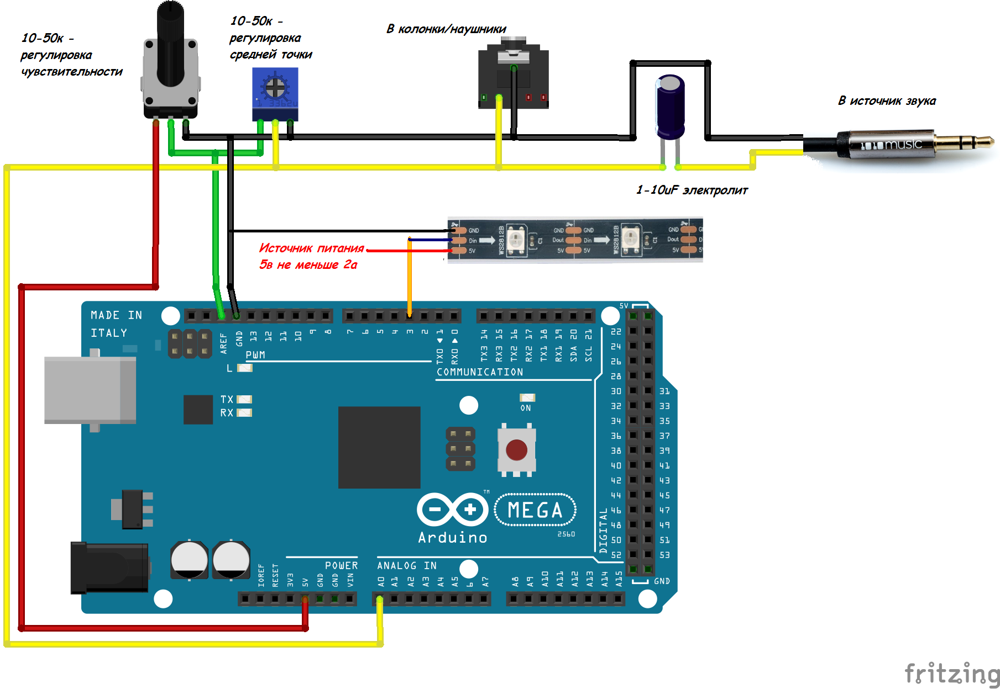

# Светомузыка на Arduino версия 1.0

# Оглавление

  * [Описание проекта](#Description)
  * [Описание папок в репозитории](#Folders_description)
  * [Компоненты и материалы](#Components)
  * [Сборка и настройка](#Assembling)
  * [FAQ](#FAQ)
  

## Описание проекта
#### *Что это?*
Самодельная светомузыка на основе платформы Arduino, переписанная с нуля после падения файловой системы на жестком диске с исходниками моих проектов.

#### *История* 
Проект начинался оооочень давно и первые варианты были построены на основе платы с обычными цветными светодиодами, управляемыми с помощью ардуино уно. Весной 2018 года Александр с канала [AlexGyver](https://www.youtube.com/channel/UCgtAOyEQdAyjvm9ATCi_Aig) подсказал мне (огромное самодельщицкое и человеческое спасибо тебе, Саня) использовать библиотеку преобразования Хартли (FHT.h) вместо доисторической fix_fft.h, с которой я не мог сладить, т к я не знал как повысить частоту опроса АЦП, да и сама библиотека была такой себе.

После этого в короткие сроки была создана первая версия на адресной светодиодной ленте, которую я так и не отснял тогда.

Ну и осенью 2018 я понял, что надо уже сделать видео про цветомузыку, но тут пришло время ехать на заключительный этап Международного конкурса детских инженерных команд 2018, поэтому все силы были брошены на завершение подготовки к конкурсу.

И тут на второй день конкурса в Питере у меня падает файловая система на жестком диске, на котором более 600 ГБ рабочей информации, проектов и программ...

Диск я планирую восстановить после зимних каникул, так как у меня нет ни памяти для сохранения, ни мощностей для сканирования диска и надо будет взять мощный ноутбук на время из Кванториума.

Ну и так как я еще до конкурса поставил себе установку сделать эту цветомузыку новогодним проектом на канал, мне пришлось за 4 дня писать все по памяти с нуля!

#### *Что дальше?*
Естесственно, это не последний вариант, тут можно сделать еще много всего интересного, также на жестком диске осталась пара интересных режимов.

## Описание папок в репозитории
  - **Soundlights_rebuilt_V1.0** - Исходный код для Arduino
  - **libraries** - требуемые для компиляции прошивки библиотеки - закинуть в C://Program Files/Arduino/libraries или ../Documents/Arduino/libraries
  - **Docs** - вспомогательные файлы для инструкции, которую вы сейчас читаете

## Материалы и компоненты (можно найти на Алиэкспрессе)
  - Arduino MEGA 2560
  - Адресная светодиодная лента на чипе WS2812B
  - Пара потенциометров, конденсатор и разъемы аудиовхода (можно найти на радиорынке или в магазине радиодеталей, ну или на крайний случай - у китайцев)

## Сборка и настройка
### Схема подключения всех компонентов

### Настройка чувствительности и средней точки
#### Настройка средней точки
 1) Для начала необходимо выставить регулятор чувствительности в среднее положние
 2) Дождаться режима VU-метра
 3) выкрутить регулятор средней точки в положение, при котором будут моргать только 1-2 светодиода или вся лента не будет гореть
 (это положение около середины)
 
  **Чувствительность настраивается на рабочем режиме громкости по режиму бегущих пиков, необходимо добиться вспышек при ударах барабанов или похожих пиках звукового сигнала**
  

## FAQ
### Основные вопросы
**В:** Как скачать с этого сайта?  
**О:** На главной странице проекта (где ты читаешь этот текст) вверху справа зелёная кнопка **Clone or download**, вот её жми, там будет [**Download ZIP**](https://github.com/MrTransistorsChannel/Soundlights_rebuilt_V1.0/archive/master.zip)

**В:** Скачался какой то файл .zip, куда его теперь?  
**О:** Это архив. Можно открыть стандартными средствами Windows, но думаю у всех на компьютере установлен WinRAR, или, на крайний случай, 7-zip, архив нужно правой кнопкой и извлечь.

**В:** Я совсем новичок! Что мне делать с Ардуиной, где взять все программы?  
**О:** Читай и смотри видосы, например, [тут](http://alexgyver.ru/arduino-first/)

**В:** Компьютер никак не реагирует на подключение Ардуины!  
**О:** Возможно у тебя зарядный USB кабель, а нужен именно data-кабель, по которому можно данные передавать  
**О:** Если у тебя китайская Ардуино, то для нее надо поставить драйвера, гугли "Драйвера CH340G" или сразу лезь [сюда](http://smart-chip.ru/drajver-dlya-arduino/)

**В:** Ошибка! Скетч не компилируется!  
**О:** Проверь, правильно ли выбрана плата, порт.  
**О:** Иногда встречается такое "Путь к скетчу не должен содержать кириллицу. Положи его в корень диска", но сам такого не замечал, хотя все скетчи храню на флешке, весь путь к ним на кириллице.  

**В:** Сколько стоит?  
**О:** Ничего не продаю, а по отдельности зависит от уровня инфляции в стране и мест покупки комплектующих)))

# По остальным вопросам добро пожаловать [сюда](https://vk.com/zvukooperator_horeografia25tm)
